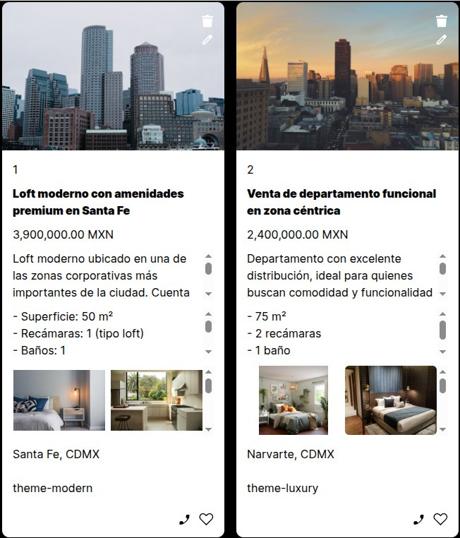
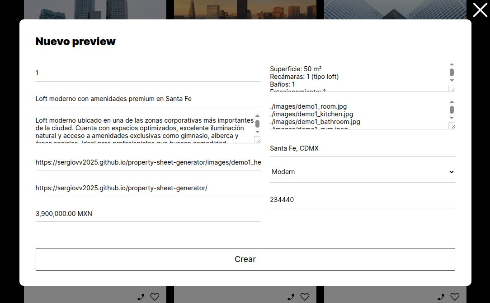
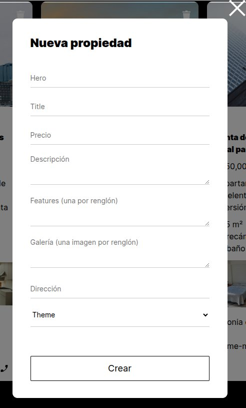
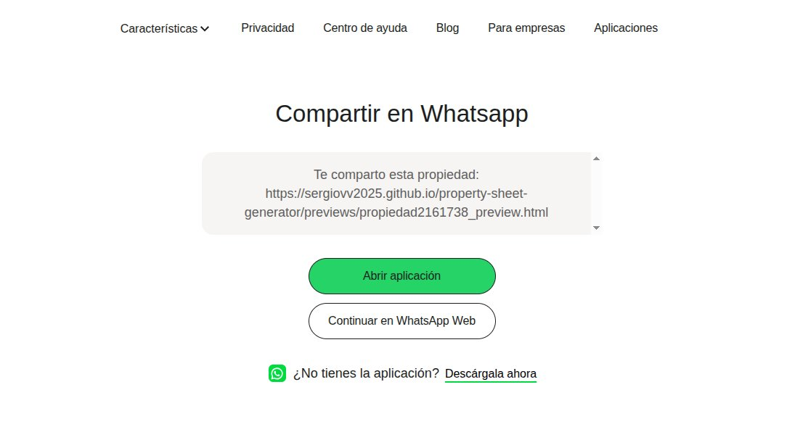

Property Sheet Generator

Aplicación web para la gestión de fichas técnicas de propiedades inmobiliarias, que implementa un sistema completo de administración en frontend con persistencia de datos y manejo de estado local.

Permite a los usuarios crear, editar, visualizar y persistir información de propiedades mediante una interfaz dinámica e interactiva.

🚀 Demo

👉 Live App: https://sergiovv2025.github.io/property-sheet-generator/
👉 Repositorio: https://github.com/SergioVV2025/property-sheet-generator

💡 Aplicación completamente funcional: permite crear, editar, eliminar y persistir propiedades en el navegador.

⚡ Quick Preview

- Crea propiedades con múltiples campos
- Edita información en tiempo real
- Guarda automáticamente en el navegador
- Exporta e importa datos manualmente
- Visualiza fichas completas con imágenes

📸 Preview

### Vista de propiedades

### Vista previa de ficha

### Creación de propiedad

### Confirmación de eliminación

### Integración con WhatsApp

### Compartir propiedades

🧩 Descripción

Este proyecto implementa un sistema tipo CRUD en el frontend, enfocado en la gestión de datos estructurados (propiedades inmobiliarias).

Incluye persistencia local, exportación/importación de datos y una interfaz basada en componentes reutilizables.

El objetivo fue simular el comportamiento de una aplicación real sin depender de servicios externos.

✨ Features

- Gestión completa de propiedades (crear, editar, eliminar)
- Persistencia de datos en navegador mediante localStorage
- Exportación e importación de datos (backup manual)
- Sistema de “likes” para marcar propiedades favoritas
- Vista previa dinámica con navegación de imágenes
- Validación de formularios en tiempo real
- Confirmación de acciones críticas mediante popups

🛠️ Tech Stack

- HTML5
- CSS3
- JavaScript (ES6+)
- Programación Orientada a Objetos (OOP)
- Manipulación del DOM
- localStorage

🏗️ Arquitectura

El proyecto sigue un enfoque modular basado en componentes:

- **Cards** → Representación visual de propiedades
- **Forms** → Captura y validación de datos
- **Popups** → Interacciones y confirmaciones
- **State Management** (local) → Manejo de datos en memoria y sincronización con localStorage

Se aplicó separación de responsabilidades para mantener el código escalable y mantenible.

🧠 Decisiones técnicas

- Uso de localStorage para simular persistencia sin backend
- Serialización de datos con JSON para exportación/importación
- Uso de clases en JavaScript para estructurar lógica (OOP)
- Renderizado dinámico para actualizar la UI sin recargar la página

📱 Comportamiento responsive

La aplicación está optimizada para uso en escritorio debido a la complejidad de los formularios de creación y edición de propiedades.

En dispositivos móviles, la experiencia está enfocada en:

- Visualizar propiedades
- Navegar vistas previas
- Compartir propiedades vía WhatsApp

La creación y edición de propiedades se recomienda en escritorio para una mejor experiencia de usuario.

📦 Instalación

git clone https://github.com/SergioVV2025/property-sheet-generator.git
cd property-sheet-generator

Abrir index.html en el navegador.

📁 Estructura del proyecto
/project-root
│── index.html
│── blocks/
│── components/
│── images/
│── pages/
│── previews/
│── respaldos/
│── utils/
│── vendor/

🗺️ Roadmap

- Integración con backend (API REST)
- Persistencia en base de datos
- Autenticación de usuarios
- Deploy en entorno productivo
- Mejora de UI/UX

📚 Lecciones aprendidas

- Manejo de estado en aplicaciones frontend sin frameworks
- Importancia de la separación de responsabilidades
- Serialización y persistencia de datos en el cliente
- Diseño de interfaces dinámicas basadas en eventos

⚠️ Nota

Los datos e imágenes utilizados son simulados y tienen fines demostrativos.

🧪 Testing manual

La aplicación fue probada manualmente cubriendo:

- Creación de múltiples propiedades
- Edición y persistencia de cambios
- Eliminación con confirmación
- Exportación e importación de datos
- Recarga de la página manteniendo estado

👨‍💻 Autor

Sergio Verástegui Vega
